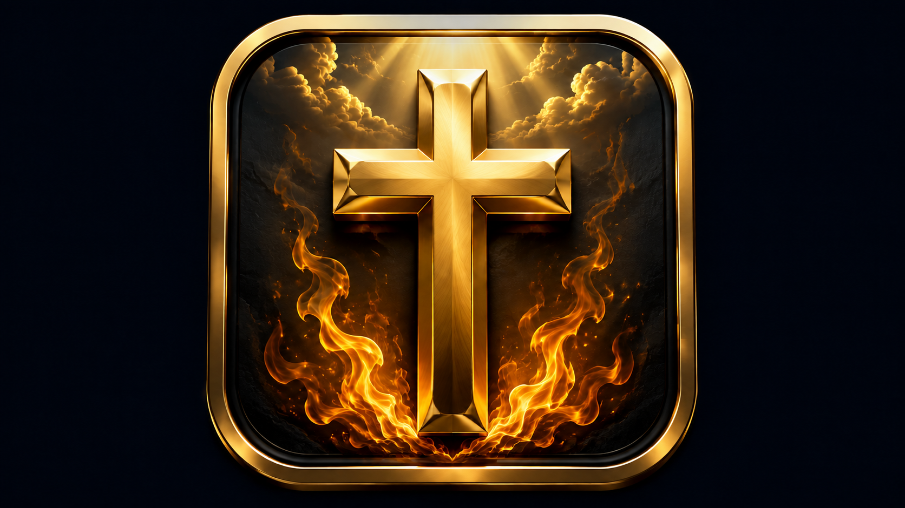
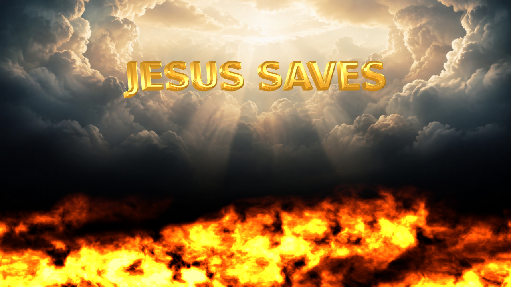

<div align="center">

<a href="docs/logo-3d.png"></a>

# JESUS SAVES
### ✦ Light. Hope. Salvation. ✦

**Reflective gold. Living flames. A heavenly sky.**<br>
A free 4K screensaver for Ubuntu and Windows, crafted in NASM assembly.

[](https://github.com/ReinhardBehrens/jesussaves/releases/download/v1.1.1/jesussaves_1.1.1_amd64.deb)
[](https://github.com/ReinhardBehrens/jesussaves/releases/download/v1.1.1/jesussaves-1.1.1-windows-x64.zip)

[🏠 Home](#jesus-saves) · [📥 Downloads](#downloads) · [🚀 Get started](#start) · [✝️ The Gospel](#gospel) · [👤 Creator](#creator)

[](https://github.com/ReinhardBehrens/jesussaves/releases/latest)
[](LICENSE)
[](docs/screenshot-4k.png)

[](docs/screenshot-4k.png)

*An actual rendered frame. Click the image to see it in 4K.*

</div>

<table>
<tr>
<td align="center" width="33%"><h3>🔥 Turbulent fire</h3>Random fuel, drifting gusts and flowing heat bring the bottom of the screen to life.</td>
<td align="center" width="33%"><h3>✨ Reflective gold</h3>Extruded 3D lettering rotates and floats across the sky with moving highlights.</td>
<td align="center" width="33%"><h3>⚙️ Two renderers</h3>Choose NASM/SSE2 CPU rendering or NASM-controlled OpenGL GPU effects.</td>
</tr>
</table>

<a name="downloads"></a>

## 📥 Downloads

| Platform | Community download | Included |
| :--- | :--- | :--- |
|  **Ubuntu 26.04.1 LTS** | [**Download `.deb`**](https://github.com/ReinhardBehrens/jesussaves/releases/download/v1.1.1/jesussaves_1.1.1_amd64.deb) | Desktop app, GNOME idle companion, XScreenSaver integration |
|  **Windows 11** | [**Download ZIP**](https://github.com/ReinhardBehrens/jesussaves/releases/download/v1.1.1/jesussaves-1.1.1-windows-x64.zip) | Portable `.exe`, native `.scr`, automatic per-user installer |
| 🧑‍💻 **Developers** | [**Download source**](https://github.com/ReinhardBehrens/jesussaves/releases/download/v1.1.1/jesussaves-1.1.1-source.tar.gz) | NASM sources, shaders, artwork, build scripts and tests |

**Intel / AMD x64 only.** A 4K monitor is optional: every frame is rendered at 4K and scaled to your display. GPU mode needs OpenGL 3.3; CPU mode is considerably slower at this resolution.

[🔎 Release notes & checksums](https://github.com/ReinhardBehrens/jesussaves/releases/latest) · [📜 GPL license](LICENSE)

<a name="start"></a>

## 🚀 Get started

###  Windows — install, then relax

1. Download the Windows ZIP and **extract the entire folder**.
2. Double-click **`install.cmd`**.
3. The installer **selects Jesus Saves, enables it, and sets a five-minute wait**. Windows Screen Saver Settings opens with that selection ready to review.

Use **Settings** to choose GPU or CPU rendering. Your existing sign-in requirement is preserved. To choose another default during installation, run `install.cmd -Minutes 10`. Moving the mouse or pressing a key exits screensaver mode.

**Already have an older version?** Close Jesus Saves, extract the new ZIP, and run its installer again. [Windows guide →](windows/README-Windows.md)

###  Ubuntu — install and launch

```bash
sudo apt install ./jesussaves_1.1.1_amd64.deb
jesussaves --gpu
```

Press **Escape** to exit. For automatic idle activation on Ubuntu GNOME:

```bash
systemctl --user daemon-reload
systemctl --user enable --now jesussaves-idle.service
```

The animation starts after four minutes of inactivity; GNOME retains control of locking. [Ubuntu setup, XScreenSaver and customization →](docs/GUIDE.md)

<a name="gospel"></a>

## ✝️ The Gospel of Jesus Christ

> “For God so loved the world, that he gave his only begotten Son, that whosoever believeth in him should not perish, but have everlasting life.”
>
> **John 3:16 · King James Version**

**The good news is Jesus Christ.** God loves us, yet sin separates us from Him. We cannot earn salvation through achievements or good works. Jesus, the Son of God, lived without sin, died for our sins, was buried, and rose again on the third day. Through Him, God offers forgiveness, reconciliation, and eternal life.

| | The message | Scripture |
| :---: | :--- | :--- |
| 🤍 | **Our need:** all have sinned and fall short of God's glory. | Romans 3:23 |
| ✝️ | **God's love:** Christ died for us while we were still sinners. | Romans 5:8 |
| 🌅 | **Christ's victory:** Jesus died for our sins, was buried, and rose again. | 1 Corinthians 15:3–4 |
| 🎁 | **God's gift:** salvation comes by grace through faith, not by works. | Ephesians 2:8–9 |
| 🙏 | **Our response:** repent, believe the Gospel, and confess Jesus as Lord. | Mark 1:15; Romans 10:9–13 |

Turn to Jesus in faith. Speak honestly to Him in prayer, ask His forgiveness, and follow Him. A prayer is not a formula that earns salvation; our trust is in Christ. Read the Gospel of John and seek a Christian church where you can learn the Scriptures, worship, and grow with others.

*This project shares that message through art. The clouds and flames are an artistic setting, not a claim to depict heaven or the afterlife literally.*

## 🛠️ Inside the project

| Explore | What you will find |
| :--- | :--- |
| [📖 User guide](docs/GUIDE.md) | Controls, idle activation, configuration, building and snapshots |
| [🧠 Rendering algorithms](docs/ARCHITECTURE.md) | Heat transport, turbulence, distance fields, reflections and performance |
| [🔌 NASM hooks](docs/HOOKS.md) | CPU/GPU interfaces and shared assembly entry points |
| [ Windows build](windows/BUILD.md) | Cross-compilation, runtime packaging and native tests |
| [🎨 Artwork provenance](docs/ASSETS.md) | Background generation, upscaling and font attribution |

**How it is coded:** NASM supplies the heat simulation, CPU flame/text rendering and GPU host hooks. GLSL runs the GPU effects. Windows uses a small C layer for calling conventions and desktop integration. Python packs assets, supplies Ubuntu integration, and runs tests.

**Test coverage:** 4K CPU/GPU output, animation, window embedding and desktop integration. Windows tests run on Windows Server 2025 with Mesa software OpenGL; physical Windows 11 GPU testing remains outstanding. Windows binaries are unsigned. The background is upscaled from a generated image; final rendering and lettering are computed at 4K.

<a name="creator"></a>

## 👤 Meet the creator

<table>
<tr>
<td width="100" align="center"><a href="https://github.com/ReinhardBehrens"></a></td>
<td><strong>Reinhard Behrens</strong><br>Creator of the Jesus Saves screensaver.<br><a href="https://github.com/ReinhardBehrens">👤 GitHub profile</a> · <a href="https://github.com/ReinhardBehrens/jesussaves/issues">💬 Report a problem or suggest an improvement</a></td>
</tr>
</table>

<div align="center">

**Made to share. Free to use. Open to contributions.**<br>
[⭐ Visit the repository](https://github.com/ReinhardBehrens/jesussaves) · [📥 Get the latest release](https://github.com/ReinhardBehrens/jesussaves/releases/latest)

</div>
